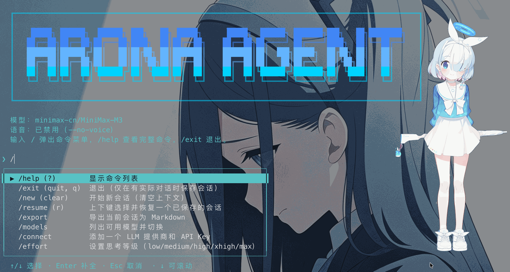

# ARONA Agent

[中文](README.md) | [English](README_en.md)




A terminal-based conversational AI Agent built on the [Pi SDK](https://www.npmjs.com/package/@earendil-works/pi-coding-agent), featuring Computer Use (desktop control), voice (TTS/STT), a desktop pet, persistent memory, and session management.

---

## Installation

```bash
npm install -g git+https://github.com/SRC114514/arona-agent.git

# Initialize configuration
arona setup

# Launch after setup
arona

# Launch with TTS/STT disabled
arona --no-voice
```

---

## Key Features

- **Computer Use**: based on [cua](https://pypi.org/project/cua/).
- **Voice**: Qwen TTS + STT.
- **Desktop pet**: transparent frameless always-on-top Electron window, Spine skeleton idle animation + emotion switching + cursor-following pupils + drag/head-pat easter egg + full-screen click/trail FX.

---

## Requirements

- **Node.js >= 22.19.0**
- **Python 3.12 / 3.13**

---

## Configuration

All configuration lives in the JSON file `~/.arona/settings.json`, generated interactively by `arona setup`. Some additional parameters must be entered manually.

| Field | Description | Default |
|---|---|---|
| `apiKey` | LLM API key | — |
| `apiBaseUrl` | API base URL (empty = auto-matched by model name) | — |
| `model` | Model name (`provider/model-id`; bare names get an auto-added prefix) | `openai/gpt-4o` |
| `thinkingLevel` | Thinking level | `medium` |
| `language` | Interface language (`auto`/`zh`/`en`) | `auto` |
| `ttsEnabled` | Enable TTS | `true` |
| `sttEnabled` | Enable STT | `true` |
| `ttsAuto` | Auto-speak replies | `true` |
| `workspaceId` | Alibaba Cloud Model Studio business space ID | — |
| `ttsApiKey` | DashScope API key (TTS) | — |
| `ttsModel` | TTS model | `qwen-audio-3.0-tts-plus` |
| `ttsVoice` | Cloned voice_id (filled by `arona setup`) | — |
| `ttsFormat` | TTS audio format (mp3/pcm/wav/opus) | `mp3` |
| `ttsSampleRate` | TTS sample rate | `22050` |
| `sttApiKey` | DashScope API key (STT) | — |
| `sttModel` | ASR model | `qwen-audio-3.0-asr-flash-streaming` |
| `sttFormat` | STT audio format | `pcm` |
| `sttSampleRate` | STT sample rate | `16000` |
| `cuaApiKey` | Computer Use (cua) API key | — |
| `pythonPath` | Python interpreter path | `python3` |
| `mcpServers` | MCP server config (JSON object) | `{}` |

Model prefix auto-detection: if `model` contains no `/`, a `provider/` prefix is added automatically based on the model name prefix or the `apiBaseUrl` domain.

---

## Data Paths (`~/.arona/`)

| Path | Description |
|---|---|
| `settings.json` | Main config file; see the [Configuration](#configuration) section for fields |
| `MEMORY.md` | Persistent memory |
| `sessions/` | Saved sessions |
| `skills/` | Custom skills |
| `undo/` | Undo/redo snapshots (bucketed by working directory) |
| `pet.json` | Desktop pet window position |

---

## Desktop Pet & STT Hotkey

- **Desktop pet**: transparent frameless always-on-top window with a looping Spine skeleton idle animation (`Idle_01`) as its base. Before each message segment the agent calls `change_emotion`; Drag to move the window; shaking the head region left-right triggers a "head-pat" easter egg; clicks/drags also fire full-screen click and trail FX. TTS plays sentence by sentence, and the emotion persists until TTS finishes, then reverts to the default automatically.
- **STT hotkey**: right Cmd key — press and hold for ≥ 2 seconds to start a one-shot recording.
- **macOS permissions**: global keyboard monitoring requires Accessibility permission for Python (System Settings → Privacy & Security → Accessibility); Computer Use screenshots require Screen Recording permission for the terminal.

---

## Slash Commands

| Category | Commands |
|---|---|
| Session | `/new` `/clear` (new session) · `/resume` (restore) · `/exit` (quit) · `/export` (export Markdown) |
| Display | `/thinking` · `/details` · `/compact` (compress context) |
| Voice | `/tts` · `/stt` |
| Extensions | `/skill` (list/invoke) · `/mcp` (manage MCP servers and tools) |
| Other | `/undo` · `/redo` · `/help` |

---

## Extensions

- **Custom Skills**: place `SKILL.md` in `~/.arona/skills/<name>/`, then invoke with `/skill <name>`.
- **MCP servers**: configure a JSON object in the `mcpServers` field of `~/.arona/settings.json`; tools are registered automatically.

---

## License

This project is open-sourced under the [MIT License](LICENSE).

---

## Copyright

This project is an independently developed unofficial project and is not directly affiliated with or endorsed by Nexon Games Co., Ltd., YOSTAR LIMITED, or the official Blue Archive game team.

- The core project code is released under the MIT License. However, no license is granted​ by this project (or any third party) for any files within the assets/blue-archive/ directory. These files pertain to the intellectual property of Blue Archive and include, but are not limited to, character illustrations, artwork, audio files, text content, and related derivative assets. No warranty of legality or usability is provided for these assets.
- The use, reproduction, and distribution of such content must strictly comply with the [rules](https://bluearchive.jp/fankit/guidelines) published by Nexon Games Co., Ltd. and YOSTAR LIMITED, as well as all applicable laws and regulations.
- This project does not provide access to these third-party files. Users must obtain legitimate copies independently from the official channels of the rights holders and assume full responsibility for their use.
- This project must not be used for distribution that infringes upon the rights of the copyright holders; any such infringement is the sole responsibility of the user.

All intellectual property rights for such content belong to Nexon Games Co., Ltd. and YOSTAR LIMITED. Usage, reproduction, and distribution must strictly adhere to the official terms set by these rights holders and applicable laws.
If a rights holder believes this disclaimer or the project's usage violates any terms, please contact me. Upon verification, the relevant content will be adjusted or removed promptly.